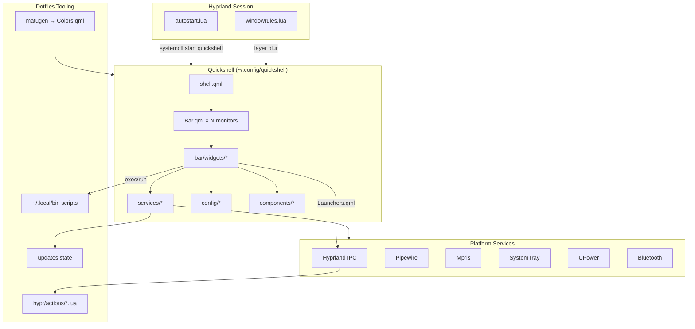
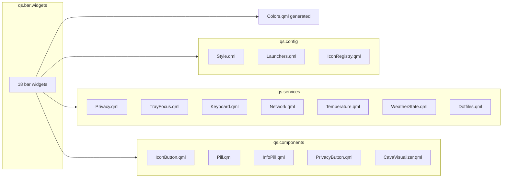
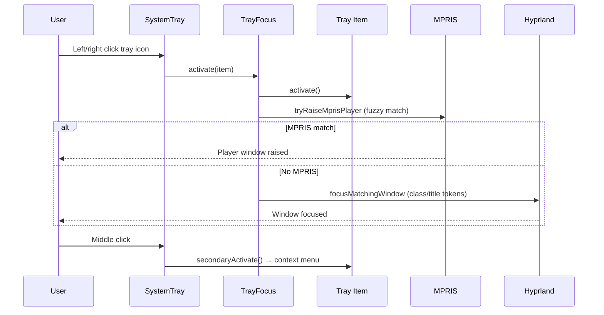
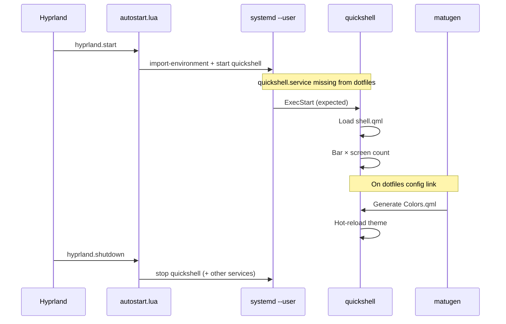

# Quickshell Bar — Codebase Overview

A multi-perspective guide to the Quickshell desktop bar in John's dotfiles. This config is a **pure QML** replacement for the former AGS (Aylur's GTK Shell) bar, preserving layout, Hyprland integration, and matugen theming while dropping the TypeScript build toolchain.

**Location:** `stow/quickshell/.config/quickshell/` → symlinked to `~/.config/quickshell/`  
**Runtime:** [Quickshell](https://github.com/outfoxxed/quickshell) (Wayland layer-shell panel)  
**Desktop stack:** Hyprland compositor + matugen themes + dotfiles helper scripts

---

## Table of Contents

1. [Executive Summary](#executive-summary)
2. [Software Architect Perspective](#software-architect-perspective)
3. [Software Developer Perspective](#software-developer-perspective)
4. [Product Manager Perspective](#product-manager-perspective)
5. [Directory Map](#directory-map)
6. [Startup & Lifecycle](#startup--lifecycle)
7. [User Interaction Flows](#user-interaction-flows)
8. [External Integrations](#external-integrations)
9. [AGS Migration Notes](#ags-migration-notes)
10. [Actionable Insights & Open Questions](#actionable-insights--open-questions)

---

## Executive Summary

| Aspect | Detail |
|--------|--------|
| **Purpose** | Bottom panel bar on every monitor: workspaces, tray, window title, media, system controls |
| **Files** | ~57 QML/assets (excluding generated `Colors.qml` and Gentle AI metadata) |
| **Entry point** | `shell.qml` — one `Bar` per screen via `Variants` |
| **State model** | QML singletons under `config/` and `services/` |
| **Hyprland bridge** | All window/workspace logic delegated to Lua `actions/*` modules |
| **Theming** | matugen generates `~/.config/quickshell/Colors.qml` (not in git) |
| **Build** | None — edit QML, Quickshell hot-reloads |

---

## Software Architect Perspective

### System Design

The bar follows a **thin UI shell, thick platform integration** pattern. Quickshell widgets render state and capture input; Hyprland Lua modules own window management; dotfiles scripts own TUIs and system workflows.



### Architecture Patterns

| Pattern | Where | Rationale |
|---------|-------|-----------|
| **Singleton services** | `config/*.qml`, `services/*.qml` | Shared reactive state without a framework |
| **Module-per-folder** | `qs.bar.widgets`, `qs.services`, etc. | Quickshell auto-maps directories to imports |
| **Dispatch bridge** | `Launchers.qml` | Single choke point for Hyprland Lua API (0.55 `hl.dsp`) |
| **Generated theme** | `Colors.qml` outside stow | Hot-reload on wallpaper change; avoid git/stow conflicts |
| **Per-monitor variants** | `shell.qml` + `Hyprland.monitorFor` | Workspace/title scoping without manual monitor logic |
| **External daemon for privacy** | `privacy-monitor.sh` | Testable, low-overhead state-change signaling |

### Scalability & Extensibility

**Strengths**

- Adding a bar widget: create `bar/widgets/Foo.qml`, import in `Bar.qml`, optionally add a service singleton.
- Hyprland behavior changes stay in one Lua codebase (`actions/*`), shared conceptually with any future shell.
- Polling tiers in `Style.qml` (1s / 5s / 30s / 10min) prevent runaway subprocess churn.

**Constraints**

- No package manager or type checking — large refactors rely on manual testing.
- Tight coupling to Hyprland-specific APIs (`Quickshell.Hyprland`, `hyprctl dispatch`).
- Weather and temperature use shell/bash polling, not native bindings — fine for a personal bar, harder to scale to many instances.

### Operational Gap

Hyprland `autostart.lua` starts `quickshell` via systemd, but **no `quickshell.service` unit exists in dotfiles** (only legacy `ags.service` remains). Session startup depends on a unit that may be missing or user-provided.

---

## Software Developer Perspective

### Entry Point

```qml
// shell.qml
ShellRoot {
    Variants {
        model: Quickshell.screens
        Bar { screen: modelData }
    }
}
```

Quickshell discovers config at `~/.config/quickshell/shell.qml` and instantiates one bottom `PanelWindow` per connected screen.

### Bar Layout

Three zones mirror the former AGS `Bar.tsx`:

| Zone | Widgets |
|------|---------|
| **Left** | Workspaces, SystemTray |
| **Center** | WindowTitle |
| **Right** | Privacy → Media → Volume → Network → Bluetooth → ScreenRecord → Keyboard → Battery → Weather → SystemTemp → Clock → SystemInfo → SystemMenu → Dotfiles |

See `bar/Bar.qml` for the canonical widget order.

### Module Map



### Hyprland Bridge (`config/Launchers.qml`)

All compositor actions go through `hyprctl dispatch` into Lua:

| Function | Target |
|----------|--------|
| `launchOrFocus(appId, cmd, fallback?)` | `actions.launchers.launchOrFocus` |
| `focusWindow(selector)` | `hl.dsp.focus` |
| `switchWorkspace(id)` | `actions.workspaces.switch` (clears `package.loaded` cache) |
| `openGnomeCalendar()` | Inline focus-or-launch for `org.gnome.Calendar` |
| `run(command)` | `Quickshell.execDetached` |

This matches the dotfiles convention: **never duplicate window logic in the shell**.

### Service Responsibilities

| Service | Mechanism | Output |
|---------|-----------|--------|
| `Privacy` | Long-running `privacy-monitor.sh` process | `webcam`, `mic`, `screenrecord`, `anyActive` |
| `TrayFocus` | Tray click handler | activate → MPRIS raise → Hyprland window focus |
| `Keyboard` | `hyprctl devices -j` + IPC events | Current layout; toggles via `system-switch-keyboard` |
| `Network` | `ip route get 8.8.8.8` poll | Default route interface for icon state |
| `Temperature` | hwmon / nvidia-smi bash poll | CPU/GPU average °C |
| `WeatherState` | curl wttr.in | Temp + condition for `$WEATHER_CITY` |
| `Dotfiles` | `FileView` on `updates.state` | `updatesAvailable` badge |

### Polling & Timing (`config/Style.qml`)

| Constant | Interval | Used by |
|----------|----------|---------|
| `pollIntervalFast` | 1s | Keyboard fallback |
| `pollIntervalNormal` | 5s | Network |
| `pollIntervalSlow` | 30s | Temperature |
| (WeatherState) | 10 min | Weather |

### Icon Strategy (`config/IconRegistry.qml`)

- **Bundled SVGs** in `assets/icons/` — themed via `ColorOverlay` in `IconButton.qml`
- **Everything else** — `Quickshell.iconPath()` from Freedesktop icon theme

### Key Implementation Conventions

1. **PascalCase** QML filenames matching component types
2. **`pragma Singleton`** for shared config/services
3. **`Colors.base00`–`base0F`** base16 slots from matugen (same as AGS)
4. **Process patterns:** long-running (`Privacy`, `CavaVisualizer`) vs one-shot polls vs `FileView` watches
5. **No README in repo by default** — this file is the onboarding doc for the shell config

### Dependencies

**Arch packages:** `quickshell`, `cava`, `impala`, `wiremix`  
**Quickshell modules:** `Hyprland`, `Wayland`, `Widgets`, `Io`, `Bluetooth`, `Networking`, `Services.Mpris`, `Services.SystemTray`, `Services.Pipewire`, `Services.UPower`  
**Generated:** `~/.config/quickshell/Colors.qml` (required at runtime)

### Developer Workflow

```bash
# Link config
dotfiles config link quickshell

# Manual run (if no systemd unit)
quickshell

# Edit QML — Quickshell hot-reloads
# Theme change — matugen regenerates Colors.qml; bar picks it up automatically
```

---

## Product Manager Perspective

### What the User Gets

A **always-visible bottom bar** on every monitor that surfaces desktop state and opens the right tool with one click — without leaving the Hyprland workflow.

### Feature Inventory

| Feature | User value | Primary interaction |
|---------|------------|---------------------|
| **Workspaces** | See and switch virtual desktops per monitor | Click pill → switch workspace |
| **System tray** | Background apps (Discord, Nextcloud, etc.) | Left/right: focus app; middle: menu |
| **Window title** | Context for focused window | Read-only; shows app icon + title |
| **Privacy indicators** | Know when cam/mic/recording is active | Visual only (colored badges) |
| **Media player** | Control music without switching windows | Hover for controls; scroll title |
| **Volume** | Adjust audio | Opens wiremix |
| **Network** | Wi-Fi/Ethernet status | Opens impala |
| **Bluetooth** | Adapter state | Opens blueman-manager |
| **Screen record** | Start/stop recording | Toggles `system-screenrecord` |
| **Keyboard layout** | See/toggle layout | Opens layout switcher |
| **Battery** | Charge state | Opens battop |
| **Weather** | Local conditions | Opens gnome-weather |
| **System temp** | CPU/GPU heat | Opens btop |
| **Clock** | Date/time | Opens gnome-calendar |
| **System info** | Machine stats | Opens fastfetch via system-info |
| **System menu** | Power/session actions | Walker system menu |
| **Dotfiles** | Config/package management | launch-dotfiles-menu; badge when updates pending |

### User Flows

#### Tray click (primary UX policy)



#### Media player selection

The bar does **not** follow Hyprland window focus for which player to show. User interaction (play/pause/skip/raise) sets `explicitPlayerKey`; otherwise playing → first active → first registered player.

This prevents jarring player switches when focusing unrelated windows — a deliberate UX choice carried from AGS.

#### Workspace switching

Click workspace pill → `Launchers.switchWorkspace(id)` → Hyprland `actions.workspaces.switch` — same behavior as keybinds and AGS bar.

### Alignment with Desktop Goals

| Goal | How the bar supports it |
|------|-------------------------|
| **Modular Hyprland config** | Shell never owns window rules — only dispatches to Lua |
| **Matugen-driven theming** | Shared base16 palette with GTK/Hypr/terminal |
| **Script-first TUIs** | Volume, network, dotfiles menus reuse `~/.local/bin` helpers |
| **Privacy awareness** | Visible cam/mic/recording indicators |
| **Minimal moving parts** | No npm build; QML edits reload live |

### Known Product Gaps vs AGS

| Missing in Quickshell | Impact |
|-----------------------|--------|
| Brightness/volume OSD overlays | No on-screen feedback for hardware keys |
| In-bar notification UI | Relies on Mako only |
| calcurse clock action | Clock opens gnome-calendar instead |
| bluetui for Bluetooth | Uses blueman-manager |

---

## Directory Map

```
.config/quickshell/
├── shell.qml                 # Entry: Variants → Bar per screen
├── Colors.qml                # GENERATED by matugen (not in stow)
├── bar/
│   ├── Bar.qml               # PanelWindow layout
│   └── widgets/              # 18 feature widgets
├── components/               # IconButton, Pill, CavaVisualizer, …
├── config/                   # Style, Launchers, IconRegistry singletons
├── services/                 # Privacy, TrayFocus, Network, … singletons
└── assets/
    ├── icons/                # 22 bundled SVG overrides
    ├── cava/config           # Audio visualizer config
    └── scripts/
        └── privacy-monitor.sh
```

**Related dotfiles paths (outside stow package):**

| Path | Role |
|------|------|
| `stow/matugen/.../quickshell-colors.qml` | matugen template |
| `stow/hypr/.../autostart.lua` | Starts quickshell on session start |
| `stow/hypr/.../windowrules.lua` | Layer blur for `quickshell` namespace |
| `lib/config.sh` | Stow link + symlink cleanup for quickshell |
| `lib/theme.sh` | Ensures `Colors.qml` exists on link |

---

## Startup & Lifecycle



---

## External Integrations

| Integration | Config / Code | Notes |
|-------------|---------------|-------|
| **Hyprland layer blur** | `windowrules.lua` — namespace `^(quickshell)$` | Frosted-glass bar intent |
| **Session env** | `env.lua` — `WEATHER_CITY` | Imported into systemd session |
| **Theme** | matugen `[templates.quickshell]` | Output: `~/.config/quickshell/Colors.qml` |
| **Dotfiles updates badge** | `~/.local/state/dotfiles/updates.state` | `UPDATES_AVAILABLE=true` |
| **Cava** | `assets/cava/config` + `CavaVisualizer.qml` | Subprocess when media playing |

---

## AGS Migration Notes

Quickshell is positioned as a **parity replacement**, not a redesign:

| Area | AGS | Quickshell |
|------|-----|------------|
| Language | TypeScript + SCSS | QML only |
| Build | pnpm | None |
| Bar layout | `widget/Bar.tsx` | `bar/Bar.qml` (same order) |
| Hyprland bridge | `services/hyprland.ts` | `config/Launchers.qml` |
| Tray focus | `widget/systemtray/service.ts` | `services/TrayFocus.qml` |
| Media selection | explicit player key | Same policy in `MediaPlayer.qml` |
| Layer namespace | `ags-bar` | `quickshell` (framework default) |
| Systemd | `ags.service` in stow | Referenced but **not stowed yet** |

---

## Actionable Insights & Open Questions

### Recommended next steps

1. **Add `quickshell.service`** under `stow/scripts/.config/systemd/user/`, modeled on `ags.service`:
   - `WorkingDirectory=%h/.config/quickshell`
   - `Environment=PATH=%h/.local/bin:...`
   - `ExecStart=/usr/bin/quickshell --daemonize` (confirm flags against installed version)
   - `Restart=on-failure`

2. **Retire or document `ags.service`** if migration is complete — avoid two shell units fighting for the bar role.

3. **OSD parity** — if hardware volume/brightness keys feel silent, port AGS OSD windows or rely on existing system OSD.

4. **Weather reliability** — wttr.in is convenient but rate-limited; consider Open-Meteo or a local cache if fetches fail often.

5. **Temperature polling** — 30s bash hwmon scrape works; native sensors API would reduce subprocess overhead if Quickshell adds bindings.

### Questions for further refinement

| Question | Why it matters |
|----------|----------------|
| Is `quickshell` intentionally listed without `.service` in autostart? | systemd accepts both; unit must exist somewhere |
| Should clock open calcurse again (AGS behavior) or stay on gnome-calendar? | Calendar workflow preference |
| Do we want Bluetooth back on bluetui for terminal consistency? | UX vs blueman GUI |
| Are notification summaries ever desired in-bar, or is Mako sufficient? | Scope creep vs AGS parity |
| Should `libastal-cava-git` be removed from AUR manifest if unused? | Package list hygiene |
| Multi-instance: need `instanceName` if running dev + prod configs? | Quickshell supports named instances |

### Testing checklist for new contributors

- [ ] Bar appears on all monitors after Hyprland login
- [ ] Workspace pills filter correctly per monitor
- [ ] Tray left-click focuses app; middle-click opens menu
- [ ] Media player sticks to explicitly selected source after interaction
- [ ] Privacy indicators light up when cam/mic/recording active
- [ ] `Colors.qml` updates after wallpaper/matugen run without shell restart
- [ ] Dotfiles button shows badge when `UPDATES_AVAILABLE=true`
- [ ] Layer blur applies to bar (check `hyprctl layers`)

---

*Generated from multi-perspective codebase analysis. For broader dotfiles conventions, see `/home/john/dotfiles/AGENTS.md`.*
